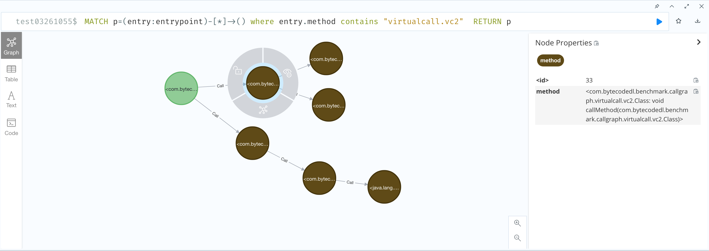

# callgraph

这节介绍调用图构造，强烈建议先看这个 [PPT](https://pascal-group.bitbucket.io/lectures/Inter.pdf)

SpeicalMethodInvocation和StaticMethodInvocation的被调用的方法在编译期间就可以确定，VirtualMethodInvocation需要在运行时根据receiver实际类型才能确定被调函数。

如何确定receiver的运行时类型，成为了调用图构造的关键，下面介绍两种调用图的构造算法及其相应的实现。

## Common

先介绍一下公共的部分。

调用图，首先是从一个入口函数开始，然后通过分析入口函数内的函数调用情况，将被调用的函数加入worklist，等待后续的分析。

定义EntryPoint(simplename:symbol, descriptor:symbol, class:Class) 为入口函数，也就是分析的起点，然后把能够调用到的方法加入到Reachable(method:Method, step:number)，把调用关系加入到CallGraph(insn:Insn, caller:Method, callee:Method)。

为了能够分析大的应用，这里限制了调用长度，在Reachable(method, step) 中step 表示从入口函数到method的调用步数。

```
// 先根据Etrypoint解析出具体的method，加入Reachable
Reachable(method, 0) :- 
    EntryPoint(simplename, descriptor, class),
    Dispatch(simplename, descriptor, class, method).

// special callee可以直接确定，所以可以直接加入到CallGraph
Reachable(callee, n+1),
CallGraph(insn, caller, callee) :-
    // 如果caller能够调用到
    Reachable(caller, n),
    // 并且caller调用步数未超过最大步数
    n < MAXSTEP,
    // 且caller 调用了 callee ，那么这些条件可以推到出callee也能访问到，且步数为n+1 调用图中caller和callee有条边
    SpecialMethodInvocation(insn, _, callee, _, caller).
// 同上
Reachable(callee, n+1),
CallGraph(insn, caller, callee) :-
    Reachable(caller, n),
    n < MAXSTEP,
    StaticMethodInvocation(insn, _, callee, caller).
```

## Class hierarchy analysis (CHA)

CHA调用图算法认为，receiver在实际运行的过程中的类型可以是其声明类型的任意非abstract子类。

```
Reachable(callee, n+1),
CallGraph(insn, caller, callee) :-
    Reachable(caller, n),
    n < MAXSTEP,
    // caller 中调用了 receiver.method() 需要根据receiver的声明类型解析
    VirtualMethodInvocation(insn, _, method, receiver, caller),
    // 找到method 对应的方法签名也就是simplename和descriptor
    MethodInfo(method, simplename, _, _, _, descriptor, _),
    // 找到receiver对应的声明类型
    VarType(receiver, class),
    // 找到receiver 自身及其所有的子类
    SubEqClass(subeqclass, class),
    // 排除被abstract修饰的类
    !ClassModifier("abstract", subeqclass),
    // 根据方法签名和类型解析出真正的被调函数callee
    Dispatch(simplename, descriptor, subeqclass, callee).
```

完整的实现见[cha.dl](../logic/cha.dl)

在benchmark使用样例见[cha-exmaple-1.dl](../example/cha-example-1.dl)

创建benchmark facts时可以加上--facts-subset 参数，只生成bechmark中的facts不再连依赖库中的一起解析。具体命令如下
```
java8 -jar ~/code/soot-fact-generator/build/libs/soot-fact-generator.jar -i Benchmark-1.0-SNAPSHOT.jar --full -l /Library/Java/JavaVirtualMachines/jdk1.8.0_211.jdk/Contents/Home/jre/lib/rt.jar -d callgraphtest --allow-phantom --generate-jimple --facts-subset APP
```

## Rapid type analysis (RTA)

待补充

## Visualization

调用图的输出结果是callgraph，是调用图中的节点，如果节点一多，不太容易寻找下一个节点，可以借助图数据库neo4j进行可视化。

经测试，通过`neo4j-admin import` 导入的效率最高。 [参考链接](https://neo4j.com/docs/operations-manual/current/tutorial/neo4j-admin-import/) 

导入neo4j docker的步骤为：
1. 执行下面命令将结果输出到output文件夹
   ```
   souffle -I ~/code/ByteCodeDL/logic -F factsdir -D ~/code/ByteCodeDL/output ~/code/ByteCodeDL/example/cha-example-1.dl
   ```
2. 执行bash importOutput2Neo4j.sh neoImportCall.sh dbname
3. 最后访问 http://ip:7474 登录 neo4j/bytecodedl


注意上述方式只能脱机导入，也就是databasname不能是正在使用的，需要指定个新的，由于社区版neo4j的限制，不能进行多数据库链接，需要通过更改配置文件切换数据库。

可以通过

```
MATCH p=(entry:entrypoint)-[*]->() where entry.method contains "virtualcall.vc2"  RETURN p 
```
查询入口函数开始的调用图，效果如下，点击节点可以在右侧看到详情




## Reference
- https://pascal-group.bitbucket.io/lectures/Inter.pdf
- https://neo4j.com/docs/operations-manual/current/tutorial/neo4j-admin-import/