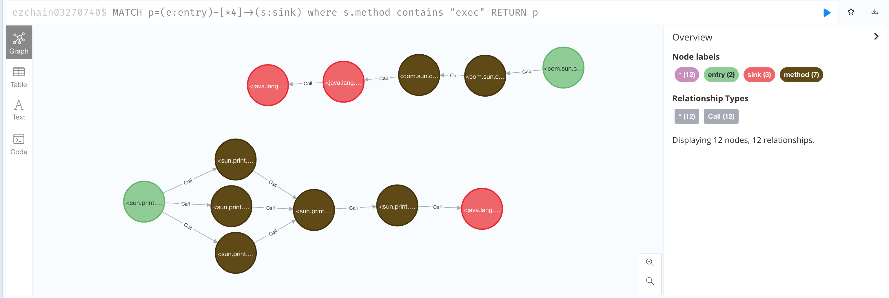

# cha in ctf

本文首发于 https://tttang.com/archive/1510/

这篇文章对应的代码分支见 [cha-in-ctf](https://github.com/BytecodeDL/ByteCodeDL/tree/cha-in-ctf/) 最好切换至该分支再进行阅读

这节将分享如何用ByteCodeDL 的 CHA 调用图分析功能，解决两个CTF题目。

## buggyLoader 0ctf-2021-final

这是0ctf 2021 决赛的一道题目，NeSE和r3kapig解出了这个题目。题目地址见 https://github.com/waderwu/My-CTF-Challenges/tree/master/0ctf-2021-final/buggyLoader 。这道题的灵感来自Shiro环境下的CC链构造，准确的说来自zsx的[这篇文章](https://blog.zsxsoft.com/post/35)

难点在于反序列化时无法创建数组类型，导致InvokerTransformer 的字段iArgs只能为null，所以最终只能调用public 无参函数。常见的反序列化最后调用的函数有：

1. JdbcRowSetImpl#getDatabaseMetaData() 和 JdbcRowSetImpl#getParameterMetaData 利用JNDI进行攻击
2. TemplatesImpl#getOutputProperties()

但是上述两类在这个题目都不能用，由于不出网，第一种方式不能用，由于TemplatesImpl的_bytecodes字段为数组，所以第二种方式也不能用。

[Orange](http://blog.orange.tw/2018/03/pwn-ctf-platform-with-java-jrmp-gadget.html)在做强网杯那题的时候，最后使用了[JRMP Client](https://github.com/frohoff/ysoserial/blob/master/src/main/java/ysoserial/payloads/JRMPClient.java) 这个payload，第一次反序列化时，发起RMI请求，然后在RMI处理响应的时候会再次触发反序列化，第二次反序列化就没有任何限制了。这种方式有两种局限，第一种是需要环境能外连，第二种是高版本的JDK下JRMP Client这个payload不能用了（具体的版本我忘了）。

如果这题能够外连，可以先调用JdbcRowSetImpl，利用JNDI发起一次RMI请求，在RMI处理响应时会再次触发反序列化，类似JRMP Client的效果，但是对JDK版本没有限制。

已知的套路都不能用了，这题该怎么做呢？重新找个能够造成危害的public 无参函数：可以直接执行命令/代码或者能够二次反序列化。

第一步我们先筛选出 public 无参函数

```dl
#include "inputDeclaration.dl"
#include "utils.dl"


.decl NonParamPublicMethod(method:Method, class:Class)
.output NonParamPublicMethod

NonParamPublicMethod(method, class) :-
    MethodInfo(method, simplename, _, class, _, _, arity),
    // method 需要被pulic修饰
    MethodModifier("public", method),
    // 排除构造函数
    simplename != "<init>",
    // 参数数量为零
    arity = 0,
    // 类需要能可序列化
    SubClass(class, "java.io.Serializable").
```

JDK中满足条件的一共10459条，如果一条条筛选下来还是比较困难的

我们再进一步做个限制，让这10459初步满足条件的函数，作为入口函数，进行调用图分析，看一下5步之内，有没有可能调用到危险函数。
[example/ctf-buggyLoader.dl](../example/ctf-buggyLoader.dl)

```dl
#define MAXSTEP 5

#include "inputDeclaration.dl"
#include "utils.dl"
#include "cha.dl"


.decl NonParamPublicMethod(method:Method, class:Class)
.output NonParamPublicMethod

// 通过class和函数名定义危险函数
.decl SinkDesc(simplename:symbol, class:Class)

// 加入常见的危险函数
SinkDesc("exec", "java.lang.Runtime").
SinkDesc("<init>", "java.lang.ProcessBuilder").
SinkDesc("start", "java.lang.ProcessImpl").
SinkDesc("loadClass", "java.lang.ClassLoader").
SinkDesc("defineClass", "java.lang.ClassLoader").
SinkDesc("readObject", "java.io.ObjectInputStream").
SinkDesc("readExternal", "java.io.ObjectInputStream").

// 定义具体的危险函数
.decl SinkMethod(method:Method)
.output SinkMethod

// 定义具体的危险函数
.decl EntryMethod(method:Method)

// 根据方法名和类名解析初具体的危险方法
// 子类中的同名方法也认为是危险函数
SinkMethod(method) :-
    SinkDesc(simplename, class),
    SubEqClass(subeqclass, class),
    !ClassModifier("abstract", subeqclass),
    MethodInfo(method, simplename, _, subeqclass, _, _, _).

// 将满足条件的无参函数作为入口方法
EntryMethod(method),
Reachable(method, 0),
NonParamPublicMethod(method, class) :- 
    MethodInfo(method, simplename, _, class, _, _, arity),
    MethodModifier("public", method),
    simplename != "<init>",
    arity = 0,
    SubClass(class, "java.io.Serializable").

// 调用图中节点
.decl CallNode(node:Method, label:symbol)
.output CallNode

// 不是入口节点和危险节点 标记为method
CallNode(node, "method") :-
    !EntryMethod(node),
    !SinkMethod(node),
    Reachable(node, _).

// 危险节点标记为 sink
CallNode(node, "sink") :-
    Reachable(node, _),
    SinkMethod(node).

// 入口节点标记为entry
CallNode(node, "entry") :-
    EntryMethod(node).

// 调用边
.decl CallEdge(caller:Method, callee:Method)
.output CallEdge

CallEdge(caller, callee) :-
    CallGraph(_, caller, callee).
```

通过 bash importOutput2Neo4j.sh neoImportCall.sh dbname 导入

执行查询

```cypher
MATCH p=(e:entry)-[*1..2]->(s:sink) where s.method contains "readObject"  RETURN p
```

长度为1-2的调用到readObject的路径

可以筛选出

```text
<java.security.SignedObject: java.lang.Object getObject()>
```

```text
<java.rmi.MarshalledObject: java.lang.Object get()>
```

但是这俩还是都需要数组字段，不满足我们的需求

对于排查不满足需求的，可以通过下面的方式删除节点，同时删除和这个节点相连的边

```cypher
MATCH (m:method) where ID(m)=42186
DETACH DELETE m
```

长度为4的查询

```cypher
MATCH p=(e:entry)-[*4]->(s:sink) where s.method contains "readObject"  RETURN p
```

```cypher
MATCH p=(e:entry)-[*4]->(s:sink) where s.method contains "readObject" and ID(e)=57653  unwind nodes(p) as n return n.method
```

查询结果

```text
<javax.management.remote.rmi.RMIConnector: void connect()>
<javax.management.remote.rmi.RMIConnector: void connect(java.util.Map)>
<javax.management.remote.rmi.RMIConnector: javax.management.remote.rmi.RMIServer findRMIServer(javax.management.remote.JMXServiceURL,java.util.Map)>
<javax.management.remote.rmi.RMIConnector: javax.management.remote.rmi.RMIServer findRMIServerJRMP(java.lang.String,java.util.Map,boolean)>
<java.io.ObjectInputStream: java.lang.Object readObject()>
```

大致的流程如下

rmiConnector.jmxServiceURL.urlPath -> base64 decode -> ByteArrayInputStream -> ObjectInputStream -> readObject

这个刚好满足我们的要求，最终的解法就是：
readOjbect -> ... -> InvokerTransformer -> RMIConnector#connect() -> .. -> readObject -> 传统的 CC 链

CHA的优点一是快，而是不存在漏报，但是这也是他的缺点，存在大量的误报，实际测试下来发现需要排除的东西还挺多，仍有不少工作量，还有很大的提升空间。后面将尝试利用污点分析对该任务的精度进行提升。

## ezchain hfctf2022

这是虎符CTF 2022年的一道题，当时bk和ty1310解出了这个题目。题目的环境见：https://github.com/waderwu/My-CTF-Challenges/tree/master/hfctf-2022/ezchain 

这也是道反序列化的题，只不过换成了Hessian反序列化，也是内网环境，无法外连。给了Rome第三方库，Marshalsec中包含了这个链，不过最后调用的是JdbcRowSetImpl ，利用JNDI完成攻击。由于无法外连，所以这条路被堵死了。熟悉反序列化的同学，应该能想到可不可以换成TemplatesImpl ， 经过调试之后发现也不行，因为Hessian在反序列化的时候不会调用readObject ，导致被transient 修饰的字段_tfactory一直为null，后续调用_tfactory.getExternalExtensionsMap()会触发空指针错误。

所以已公开的东西都用不了了，需要重新找链，通过分析之后Rome链一直能用到调用任意无参数的getter函数，所以我们只要再重新找个getter函数即可。和上题差不多，危险函数可以是能够执行命令/代码或者能够造成二次反序列化。

其实在上题中，我们已经找到了一个满足条件的getter函数，那就是

```text
<java.security.SignedObject: java.lang.Object getObject()>
```

利用这个然后可以造成二次反序列化，然后就可以使用ysoserial中的rome链了，这个解法是二血ty1310队伍提供的。

只要将ctf-buggyLoader.dl中的入口函数限制改一下，就可以用到这个题上

[example/ctf-ezchain.dl](../example/ctf-ezchain.dl)

```dl
EntryMethod(method),
Reachable(method, 0),
NonParamPublicMethod(method, class) :- 
    MethodInfo(method, simplename, _, class, _, _, arity),
    MethodModifier("public", method),
    // 方法名包含get
    contains("get", simplename),
    // 无参数
    arity = 0.
    // hessian反序列化时不要求实现Serializable
```

如果按照这个版本的[cha.dl](https://github.com/BytecodeDL/ByteCodeDL/blob/75a90a8baf9ebbcee573498d8077f61d2a8b338a/logic/cha.dl) 只能找到下面这个，这个我也已经验证可以用。payload我就不给了，大家可以参考UnixPrintServiceLookup进行构造。

```text
<com.sun.corba.se.impl.activation.ServerManagerImpl: int[] getActiveServers()>
<com.sun.corba.se.impl.activation.ServerTableEntry: boolean isValid()>
<com.sun.corba.se.impl.activation.ServerTableEntry: void activate()>
<java.lang.Runtime: java.lang.Process exec(java.lang.String)>     
```

但是并没有找到预期解，这个UnixPrintServiceLookup这个类，这是因为在构造调用图时没有考虑一种间接调用，这种间接调用可以简化成这种

```java
caller(){
    AccessController.doPrivileged(new PrivilegedExceptionAction() {
        public Object run() throws IOException {
            callee();
        }
    }
}
```

由于doPrivileged是native方法，无法进行后续的分析，这里就需要进行个特殊处理，认为caller可以直接调用这个run方法

```dl
CallGraph(insn, caller, callee) :- 
    Reachable(caller, n),
    n < MAXSTEP,
    StaticMethodInvocation(insn, _, method, caller),
    MethodInfo(method, "doPrivileged", _, "java.security.AccessController", _, _, _),
    ActualParam(0, insn, param),
    VarType(param, type),
    MethodInfo(callee, "run", _, type, _, _, 0).
```

改进之后的完整版本[cha.dl](../logic/cha.dl)

然后当长度为设置4的时候就可以查到了



```dl
MATCH p=(e:entry)-[*6]->(s:sink) where s.method contains "exec"  RETURN p
```

长度设置为6，在76880 nodes 1119478 relationships 的情况下就差不来了，不知道建立索引或者啥的会不会好一点
