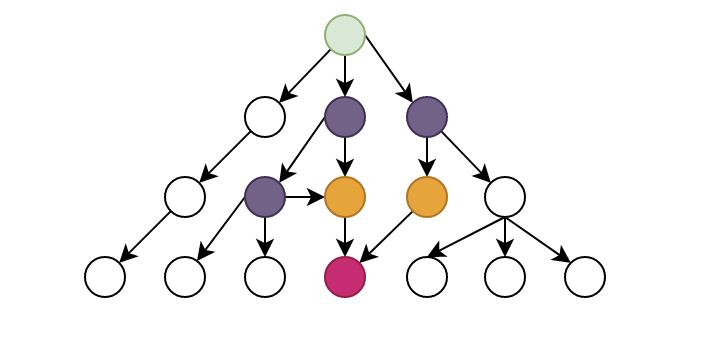

# cha-optimization

## 实现&分析

在实际测试中发现，如果路径过长会出现neo4j查询不出来的情况，还需要对CHA进行进一步优化。优化方向有两个：

1. 尽可能减少节点的数量
2. 尽可能减少环路的出现

目前采取的遍历算法，有点类似于从entry出发，进行广度优先遍历(bfs)。实际的节点表现可能是这样的



从这张图可以看出，有用的节点其实是标有颜色的那些节点，其中绿色表示entry，红色表示sink。但是在导入的时候其他节点也会被导入。

我们可以通过从sink向上回溯，筛选出那些能够到达sink的节点，就可以把这些有颜色的节点筛选出来。

定义SinkReachable(method:Method, sink:Method, step:number) 表示 method 经过 step步能调用到 sink 。

那么久可以根据CallGraph(insn, caller, callee) 一步步向上回溯了，具体规则见

```dl
// 初始化 sink 到 sink 为 0
SinkReachable(sink, sink, 0) :-
    SinkMethod(sink).

// 如果caller 调用 了 callee
// 且 callee n 步到 sink
// 那么能够推导出 caller n+1 步 能到 sink
SinkReachable(caller, sink, n+1) :-
    n < MAXSTEP,
    SinkReachable(callee, sink, n), 
    CallGraph(_, caller, callee).
```

更近一步我们还可以寻找从entry 到 sink 的最短路径

定义 ShortestPathToSink(caller:Method, sink:Method, step:number) 表示caller 经过最短step步 到达 sink 

```dl
// 筛选出entry 到 sink 的 最短长度 n
ShortestPathToSink(entry, sink, n) :- 
    n = min step : {SinkReachable(entry, sink, step)},
    SinkMethod(sink),
    EntryMethod(entry).

// 如果caller 到 sink 最短距离 为 n
// 且 calle 到 sink 的距离为n-1
// 且 caller 调用 callee
// 那么可以推导出 callee 到 sink 的 最短距离为 n-1
ShortestPathToSink(callee, sink, n-1) :-
    n < MAXSTEP + 1,
    ShortestPathToSink(caller, sink, n),
    SinkReachable(callee, sink, n-1),
    CallGraph(_, caller, callee).
```

这里稍微解释一下

```dl
ShortestPathToSink(entry, sink, n) :-
    n = min step : {SinkReachable(entry, sink, step)},
    SinkMethod(sink),
    EntryMethod(entry).
```

大概的执行顺序是

1. 先从EntryMethod 选出一个 entry
2. 从SinkMethod 选出一个 sink
3. 然后从SinkReachable 找出第一个值为entry 第二个值为sink的数据，从这些数据中选出最小的step

这种就找到entry到sink的最短距离为n

## 使用方法

通过宏定义 可以配置不同的优化级别

1. `#define CHAO 1` 返回的是所有能到sink的节点
2. `#define CHAO 2` 返回的是entry到sink最短路径上的节点
3. 如果没有 CHAO 宏定义 则 返回的是entry在MAXSTEP之内能到达的所有节点

使用样例

[ctf-buggyLoader.dl](../example/ctf-buggyLoader.dl)

```dl
#define MAXSTEP 5
#define CHAO 2

#include "inputDeclaration.dl"
#include "utils.dl"
#include "cha.dl"


.decl NonParamPublicMethod(method:Method, class:Class)
.output NonParamPublicMethod

// 声明sink
SinkDesc("exec", "java.lang.Runtime").
SinkDesc("<init>", "java.lang.ProcessBuilder").
SinkDesc("start", "java.lang.ProcessImpl").
SinkDesc("loadClass", "java.lang.ClassLoader").
SinkDesc("defineClass", "java.lang.ClassLoader").
SinkDesc("readObject", "java.io.ObjectInputStream").
SinkDesc("readExternal", "java.io.ObjectInputStream").

// 声明入口方法
EntryMethod(method),
Reachable(method, 0),
NonParamPublicMethod(method, class) :- 
    MethodInfo(method, simplename, _, class, _, _, arity),
    MethodModifier("public", method),
    simplename != "<init>",
    arity = 0,
    SubClass(class, "java.io.Serializable").

.output SinkMethod
```

## 优化效果

以ctf-buggyLoader为例

1. 无 CHAO 宏定义
   - Nodes: 68561
   - Relations: 1080201
   - Time 1:39.87 s
2. `#define CHAO 1`
   - Nodes: 3864
   - Relations: 55736
   - Time: 20.859 s
3. `#define CHAO 2`
   - Nodes: 722
   - Relations: 3672
   - Time: 20.134 s

优化效果还行，之所以优化之后的时间更短，我猜测可能是IO更浪费时间，因为不优化的CallNode.csv 和 CallEdge.csv 都上百M了 。
