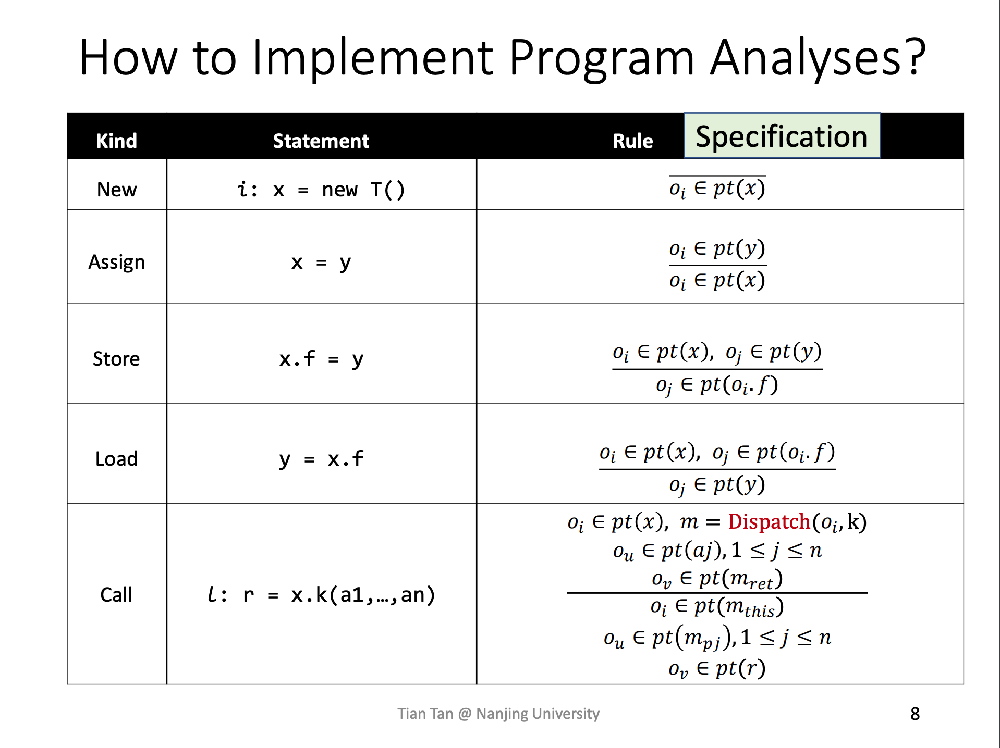

# context-insensitive-points-to

以防后续更新代码，导致与本文描述的有所冲突，建议切换到 [pt-noctx](https://github.com/BytecodeDL/ByteCodeDL/blob/pt-noctx/docs/context-insensitive-points-to.md) 分支进行阅读

## 介绍

本文主要介绍上下文无关指针分析，建议读本文档之前，先学习

- https://pascal-group.bitbucket.io/lectures/PTA.pdf
- https://pascal-group.bitbucket.io/lectures/PTA-FD.pdf
- https://pascal-group.bitbucket.io/lectures/Datalog.pdf
- https://souffle-lang.github.io/components

最主要的是理解这个图


指针分析主要是为了计算指针在运行过程中可能指向的对象，java中指针包括普通的变量，实例的字段，静态字段，以及数组元素等。由于Java多态的特性，不能仅根据声明类型解析函数调用，需要根据变量实际运行时的类型解析，通过指针分析可以得到变量在运行时指向的对象，进而可以得到对象的类型，然后根据类型即可解析出正确的被调函数，从而得到相对准确的函数调用图，准确的函数调用图对于过程间的分析至关重要，因此指针分析被视为Java静态分析的基础。

对象的生成通过关键字new，然后通过指令，在指针之间传播对象信息，指令包括

- new
  - 生成对象
- Assign
  - 变量之间赋值
- Store Instance Field
  - 写入field 写入的其实是x对应的对象实例相应的字段
- Load Instance Field
  - 读取field 读取的其实是x对应的对象实例相应的字段
- Call
  - 首先根据x的指向对象的类型以及函数签名解析出具体函数m
  - 设计到的传播关系有
    - 实际传参数 到 形式参数
    - 形式返回值 到 实际返回值
    - base 到 this

实现的时候还要考虑，类型转换(Cast)，读写静态字段(Static Field)，读写数组(Array)

指针分析有很多影响因素，包括是否上下文敏感(Context-Sensitive)，是否流敏感(Flow-Sensitive)，是否字段敏感(Field-Sensitive)等，这些因素会影响指针分析的精度和效率。

本次实现的是上下文不敏感，流不敏感，数组不敏感，字段敏感的指针分析。

- 上下文不敏感
  - 也就是对上下调用的上下文不敏感，也可以理解为没有调用的上下文
- 流不敏感
  - 指令的顺序不影响最终的分析结果，默认所有的分支都能走到
- 数组不敏感
  - 不区分数组中不同索引对应的值
- 字段敏感
  - 区分对象的不同字段

## 实现

[pt-noctx.dl](../logic/pt-noctx.dl) 主要就是将上图的规则用datalog表示。

```dl
// 建立一个Component，主要是为了解决命名冲突
.comp ContextInsensitivePt{
    // 表示 var 变量 指向 heap 这个对象
    .decl VarPointsTo(heap:Heap, var:Var)
    // 表示 baseHeap 这个对象的 field 指向 heap 这个对象
    .decl InstanceFieldPointsTo(heap:Heap, baseHeap:Heap, field:Field)
    // 表示 静态 field 指向 heap 这个对象
    .decl StaticFieldPointsTo(heap:Heap, field:Field)
    // 表示 baseHeap数组中，包含了heap对象
    .decl ArrayIndexPointsTo(heap:Heap, baseHeap:Heap)
    // 表示 在insn指令中 caller 调用了 callee
    .decl CallGraph(insn:Insn, caller:Method, callee:Method)
    // 表示 方法可访问到
    .decl Reachable(method:Method)

    // new
    // 如果 method 方法可访问
    // 且 在method中，将创建号的heap对象赋值给了var变量
    // 那么能够推导出 var变量指向 heap 对象
    VarPointsTo(heap, var) :-
        Reachable(method),
        AssignHeapAllocation(_, _, heap, var, method, _).
    
    // assign
    // 如果method 方法可访问
    // 且 form 变量 指向 heap 对象
    // 且 在method中，将from变量赋值给了to 即 to=form
    // 那么能够推到出 to变量也指向 heap 对象
    VarPointsTo(heap, to) :- 
        Reachable(method),
        VarPointsTo(heap, from),
        AssignLocal(_, _, from, to, method).
    
    // cast
    // 如果method 方法可访问
    // 且 form 变量 指向 heap 对象
    // 且 在method中，将from变量类型转换后赋值给了to 即 to=(T)from
    // 那么能够推到出 to变量也指向 heap 对象
    VarPointsTo(heap, to) :- 
        Reachable(method),
        AssignCast(_, _, from, to, _, method),
        VarPointsTo(heap, from).
    
    // load field
    // 如果method 方法可访问
    // 且 在method中，将base变量的field取出赋值给了to 也就是 to=base.field
    // 且 base 指向 baseHeap 对象
    // 且 baseHeap对象的field指向 heap 对象
    // 那么能够推到出 to 也指向 heap 对象
    VarPointsTo(heap, to) :-
        Reachable(method),
        LoadInstanceField(_, _, to, base, field, method),
        VarPointsTo(baseHeap, base),
        InstanceFieldPointsTo(heap, baseHeap, field).
    
    // store field
    // 如果method 方法可访问
    // 且 在method中，将from存到了变量base的field，也就是base.field=from
    // 且 from 指向 heap 对象
    // 且 base 指向 baseHeap 对象
    // 那么 能够推到出baseHeap对象的field也指向 heap 对象
    InstanceFieldPointsTo(heap, baseHeap, field) :-
        Reachable(method),
        StoreInstanceField(_, _, from, base, field, method),
        VarPointsTo(heap, from),
        VarPointsTo(baseHeap, base).
    
    // load staic field
    // 如果method 方法可访问
    // 且 在method中，将静态field取出赋值给了to 即 to = T.field
    // 且 field 指向 heap 对象
    // 那么可以推导出 to 也指向 heap 对象
    VarPointsTo(heap, to) :-
        Reachable(method),
        LoadStaticField(_, _, to, field, method),
        StaticFieldPointsTo(heap, field).
    
    // store static field
    // 如果method 方法可访问
    // 且在method中，将from存入静态field 即 T.field = from
    // 且 from 指向 heap 对象
    // 那么可以推到出 静态field指向 heap 对象
    StaticFieldPointsTo(heap, field) :-
        Reachable(method),
        StoreStaticField(_, _, from, field, method),
        VarPointsTo(heap, from).
    
    // load from array
    // 如果method可访问
    // 且 从base数组中取出元素到to to = base[i]
    // 且 base 指向 baseHeap 数组对象
    // 且 baseHeap 数组对象中 包含 heap 对象
    // 那么 to 可能指向 heap 
    // 这里的实现未区分取第几个索引
    VarPointsTo(heap, to) :-
        Reachable(method),
        LoadArrayIndex(_, _, to, base, method),
        VarPointsTo(baseHeap, base),
        ArrayIndexPointsTo(heap, baseHeap).

    // store into array
    // 如果method可访问
    // 将 form 存到 base 数组中 即 base[i] = from
    // from 指向 heap 对象 
    // base 指向 baseHeap 数组对象
    // 那么能推导出 baseHeap 数组对象 包含 heap 对象
    ArrayIndexPointsTo(heap, baseHeap) :-
        Reachable(method),
        StoreArrayIndex(_, _, from, base, method),
        VarPointsTo(heap, from),
        VarPointsTo(baseHeap, base).
    
    // 下面开始涉及到过程间的指针分析
    // 先构造调用图
    // Special 和 Static 和 CHA 处理方式一样，编译时callee就确定，不需要再进行解析
    Reachable(callee),
    CallGraph(insn, caller, callee) :- 
        Reachable(caller),
        SpecialMethodInvocation(insn, _, callee, _, caller).
    
    Reachable(callee),
    CallGraph(insn, caller, callee) :- 
        Reachable(caller),
        StaticMethodInvocation(insn, _, callee, caller).
    
    // Virtual Call 需要根据 base 指向 对象 的类型 进行 dispatch
    // caller 要可达
    // 在caller 中 virtual call 了 method
    // 调用时 base 指向 baseHeap 对象
    // baseHeap 对象的类型 为 class
    // 根据method 解析出 被调函数的签名
    // 通过 函数签名 和 实际类型 解析出真正的被调函数callee
    Reachable(callee),
    CallGraph(insn, caller, callee) :- 
        Reachable(caller),
        VirtualMethodInvocation(insn, _, method, base, caller),
        VarPointsTo(baseHeap, base),
        NormalHeap(baseHeap, class),
        MethodInfo(method, simplename, _, _, _, descriptor, _),
        Dispatch(simplename, descriptor, class, callee).
    
    // param
    // 调用图中存在调用 insn
    // 调用时第n个实际参数传的是 变量 arg
    // 被调函数 callee 的 第 n 个 形式参数是 param
    // 如果 arg 指向了heap 对象
    // 那么 param 也指向heap 对象
    VarPointsTo(heap, param) :- 
        CallGraph(insn, _, callee),
        ActualParam(n, insn, arg),
        FormalParam(n, callee, param),
        VarPointsTo(heap, arg).
    
    // return
    // 调用图中存在调用 insn
    // 如果 在callee中，返回语句返回的是var变量
    // 调用后的返回值赋值给了return变量
    // var 变量 指向 heap 对象
    // 那么 return 也指向 heap 对象
    VarPointsTo(heap, return) :- 
        CallGraph(insn, _, callee),
        Return(_, _, var, callee),
        AssignReturnValue(insn, return),
        VarPointsTo(heap, var).
    
    // this
    // 调用图中存在调用 insn
    // 调用时 base 指向 heap
    // 那么调用时callee 的 this 变量 也指向 heap 对象
    VarPointsTo(heap, this) :- 
        CallGraph(insn, _, callee),
        (
            VirtualMethodInvocation(insn, _, _, base, _);
            SpecialMethodInvocation(insn, _, _, base, _)
        ),
        ThisVar(callee, this),
        VarPointsTo(heap, base).
}
```

## 使用样例

[pt-noctx-example-1.dl](../example/pt-noctx-example-1.dl)

```dl
#include "inputDeclaration.dl"
#include "utils.dl"
#include "pt-noctx.dl"

// 实例化 component
.init cipt = ContextInsensitivePt

// 初始化readchable
cipt.Reachable(method) :-
    MethodInfo(method, simplename, _, _, _, descriptor, _),
    simplename = "main",
    descriptor = "([Ljava/lang/String;)V".

.output cipt.VarPointsTo
```

创建benchmark facts

```bash
 java8 -jar soot-fact-generator/build/libs/soot-fact-generator.jar -i Benchmark-1.0-SNAPSHOT.jar --full -l /Library/Java/JavaVirtualMachines/jdk1.8.0_211.jdk/Contents/Home/jre/lib/rt.jar -d pttest --allow-phantom --generate-jimple --facts-subset APP
```

然后执行

```bash
souffle -I ByteCodeDL/logic -F factsdir -D ByteCodeDL/output ByteCodeDL/example/pt-noctx-example-1.dl
```

分析结果保存在 output/cipt.VarPointsTo

如果想学习更完善的指针分析，可以看一下这两个repo

- https://github.com/souffle-lang/java-pts
- https://bitbucket.org/yanniss/doop/src

搞学术的可以去看看doop
